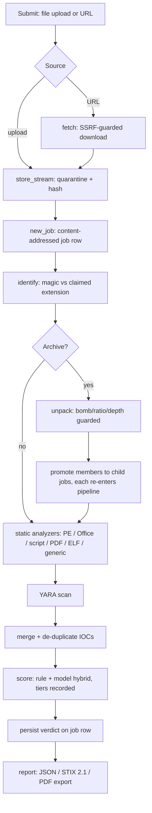
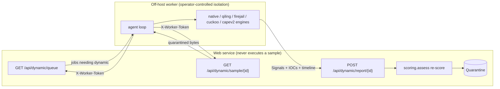

# Architecture

Cyclowareness Sandbox is a static-first file and URL threat-analysis service. A
submitted sample is quarantined and never executed by the web service; it is
identified, unpacked, statically analysed, scanned with YARA, scored by a
transparent hybrid model, and turned into an exportable report. Behavioural
detonation is a separate, opt-in tier that runs off-host on hardware the
operator controls.

This document describes the request lifecycle, the analysis contract every
component speaks, the static/dynamic tier split and its off-host worker seam, and
the module map — where each concern lives in this repository.

---

## 1. Request lifecycle

Every submission — an uploaded file or a fetched URL — follows one pipeline. The
orchestrator lives in [`backend/app/engine/pipeline.py`](backend/app/engine/pipeline.py);
each stage writes its outcome onto the job row before the next begins, so a job
that dies half-way is inspectable rather than merely "failed", and the UI can
show where a job is while it is still moving.

The stages, in order:

1. **Ingest.** An upload streams straight into quarantine, hashed as it goes
   ([`storage.store_stream`](backend/app/engine/storage.py)); a URL is downloaded
   first by the SSRF-guarded fetcher ([`fetcher.fetch`](backend/app/engine/fetcher.py))
   and then stored the same way. The size cap is enforced *while* streaming, not
   after — a `Content-Length` header is a claim by the sender.
2. **Identify.** [`identify.identify`](backend/app/engine/identify.py) reads the
   content's magic bytes and compares them to the extension the submitter
   claimed. The gap between claim and content (`invoice.pdf` whose first bytes
   are `MZ`) is itself one of the strongest malicious signals, which is why
   identification is a distinct step. It yields a coarse `family`
   (`pe`/`elf`/`office`/`script`/`pdf`/`archive`/…) used to dispatch analyzers.
3. **Unpack.** If the sample is an archive, [`archives.unpack`](backend/app/engine/archives.py)
   extracts it under a total-expansion budget, a per-entry compression-ratio
   cap, and a depth limit (zip-bomb defence). Each extracted member up to
   `MAX_CHILD_JOBS` is promoted to a **child job** that re-enters this same
   pipeline. An archive is scored as dangerous as its worst member. Encrypted
   archives park the job in `AWAITING_PASSWORD` — they are never brute-forced.
4. **Static analyse.** [`analyzers.run_all`](backend/app/engine/analyzers/__init__.py)
   runs every analyzer that claims the sample's family, plus the universal
   `generic` analyzer. An analyzer that raises on a hostile sample is converted
   to an honest `unavailable` result rather than failing the whole job.
5. **YARA.** [`yara_engine.analyze`](backend/app/engine/yara_engine.py) scans the
   bytes against the rules in [`backend/app/engine/rules/`](backend/app/engine/rules/)
   and emits `yara.*` signals.
6. **Score.** [`scoring.assess`](backend/app/engine/scoring.py) reads the signals
   (and nothing else) and produces a rule score, a model score, the
   `0.6·rule + 0.4·model` blend, a risk band, and a full breakdown. It also
   records which tiers actually ran.
7. **Report.** [`report.py`](backend/app/engine/report.py) renders the persisted
   verdict as JSON, STIX 2.1, or PDF on demand. It never re-runs an analyzer and
   never touches the sample on disk.

Analysis runs on a background thread pool ([`runner.py`](backend/app/runner.py)),
not inside the request handler: a request that blocks for a full analysis is one
an attacker can hold open to exhaust the server. Submission returns a job id
immediately and the client polls `/api/result/{id}`.

---

## 2. The analysis contract: Signal and AnalyzerResult

Everything downstream of an analyzer speaks one vocabulary, defined in
[`backend/app/engine/contracts.py`](backend/app/engine/contracts.py). Nothing
downstream knows which analyzer — static, dynamic, native, or a third-party
sandbox — produced a result. That is what lets the engine run with three
analyzers on a managed host and eleven on a lab box without any other code
changing.

- **`Signal(id, title, severity, detail, evidence)`** — one observation, stated
  so a human can disagree with it. `severity` is one of
  `info`/`low`/`medium`/`high`/`critical`. `id` is a stable machine identifier
  (`pe.high_entropy`) that scoring weights and YARA-to-rule mappings key off.
- **`IOCs(urls, domains, ips, emails, hashes, file_paths, registry_keys, mutexes)`**
  — indicators lifted from the sample, additive and de-duplicated on merge: an
  indicator seen by two analyzers is one indicator with more support.
- **`AnalyzerResult(analyzer, ran, unavailable_reason, signals, facts, iocs, duration_ms)`**
  — what one analyzer produced. `facts` is structured detail for the report
  (PE sections, macro names, the archive tree); it is **never scored**.

Two rules the whole engine rests on:

1. **A Signal is the only thing that can move a score.** Analyzers observe; they
   do not score. Scoring reads signals and nothing else, which is why the final
   number can always be explained back to a list of sentences a human can read.
   This is the central reason the score is defensible: no analyzer can quietly
   inflate a verdict, because no analyzer emits a number.
2. **An analyzer that could not run says so.** `ran=False` with an
   `unavailable_reason` is a first-class outcome. "We did not look" and "we
   looked and it was clean" are different claims, and a security product that
   confuses them is worse than one that admits the gap.

Because the contract is the contract, a dynamic finding from an off-host worker
scores, exports, and displays identically to a static one — it simply arrives in
the same `Signal`/`IOCs` shape.

---

## 3. Static vs dynamic tiers, and the off-host worker seam

The distinction between the two tiers is load-bearing, and every report states
which of them ran.

- **Static tier** — parsers plus YARA plus scoring. It **never executes the
  sample**. It runs anywhere, including on managed PaaS hosting, and is the tier
  this repository's web service implements in full.
- **Dynamic tier** — detonation, syscall tracing, the native behaviour engine,
  and open-source sandbox integrations. All of these require a disposable,
  network-isolated VM with kernel-level control. A managed web host does not
  provide that and *must not*: executing hostile code on shared infrastructure
  is exactly the risk this codebase is built to avoid.

So the web service defines a **seam** rather than a detonator. The contract lives
in [`backend/app/engine/native.py`](backend/app/engine/native.py) (which contains
no detonation code — deliberately, not as a gap) and is exposed over HTTP by
[`backend/app/api/dynamic.py`](backend/app/api/dynamic.py). An off-host worker
([`worker/`](worker/)) claims jobs, fetches the quarantined bytes, detonates them
inside isolation it controls (firejail/seccomp jail, a Qiling emulator, a
snapshotted VM behind a sinkhole), and posts findings back in the same Signal
vocabulary.

The seam is authenticated by a shared `X-Worker-Token` (env `DYNAMIC_WORKER_TOKEN`),
never an analyst session — the worker is infrastructure, not a user. When no
token is configured the whole seam is closed (503): accepting externally-supplied
"behaviour" into a verdict is a trust decision the operator must make
deliberately. Until a worker attaches, `native.dynamic_available()` is `False`,
the pipeline records the dynamic tier as *not run* with a plain-language reason,
and every report says so. A re-scored dynamic verdict can only add evidence the
static tier did not have.

---

## 4. Module map

Where each concern from the brief's suggested module split lives in this repo.
The brief lists twelve concerns (uploader, fetcher, storage, archive-handler,
static-analyzer, scoring, orchestrator, reporter, TI-enrichment, frontend, infra,
plus the dynamic worker); each maps to a named file or directory here.

| Concern | Location | Notes |
|---|---|---|
| **Uploader** | [`backend/app/api/sandbox.py`](backend/app/api/sandbox.py) `POST /api/analyze` | Streams into quarantine; auth-gated. |
| **Fetcher** | [`backend/app/engine/fetcher.py`](backend/app/engine/fetcher.py) | SSRF-guarded URL download, re-validated per redirect hop. |
| **Storage / quarantine** | [`backend/app/engine/storage.py`](backend/app/engine/storage.py) | Content-addressed, owner-read-only, non-executable, streaming size cap. |
| **Archive handler** | [`backend/app/engine/archives.py`](backend/app/engine/archives.py) | Bomb/ratio/depth guards; encrypted archives never brute-forced. |
| **Identify** | [`backend/app/engine/identify.py`](backend/app/engine/identify.py) | Magic-byte content typing vs claimed extension. |
| **Static analyzers** | [`backend/app/engine/analyzers/`](backend/app/engine/analyzers/) | `generic`, `pe`, `office`, `scripts`, `pdf`, `elf` + registry. |
| **YARA engine** | [`backend/app/engine/yara_engine.py`](backend/app/engine/yara_engine.py), rules in [`rules/`](backend/app/engine/rules/) | Emits `yara.*` signals. |
| **Scoring** | [`backend/app/engine/scoring.py`](backend/app/engine/scoring.py) | Rule + expert-weighted model hybrid; every point explainable. |
| **Orchestrator** | [`backend/app/engine/pipeline.py`](backend/app/engine/pipeline.py), [`backend/app/runner.py`](backend/app/runner.py) | Stage machine + background thread pool. |
| **Reporter** | [`backend/app/engine/report.py`](backend/app/engine/report.py) | JSON / STIX 2.1 / PDF views of the persisted job. |
| **TI enrichment** | [`backend/app/engine/integrations/`](backend/app/engine/integrations/) | Descriptor catalog (VirusTotal, Strelka, …) rendered by `/api/capabilities`. |
| **Contracts** | [`backend/app/engine/contracts.py`](backend/app/engine/contracts.py) | `Signal` / `IOCs` / `AnalyzerResult` / risk banding. |
| **Auth** | [`backend/app/auth.py`](backend/app/auth.py), [`backend/app/api/auth.py`](backend/app/api/auth.py) | HMAC session tokens + static API keys. |
| **Dynamic seam** | [`backend/app/api/dynamic.py`](backend/app/api/dynamic.py), [`backend/app/engine/native.py`](backend/app/engine/native.py) | HTTP contract for the off-host worker. |
| **Admin / tuning** | [`backend/app/api/admin.py`](backend/app/api/admin.py) | Runtime rule/model weight split. |
| **Metrics** | [`backend/app/metrics.py`](backend/app/metrics.py), `/metrics` | Prometheus, degrades to no-ops if the client is absent. |
| **Config** | [`backend/app/config.py`](backend/app/config.py) | Demo vs production posture; refuses unsafe production boot. |
| **Persistence** | [`backend/app/db.py`](backend/app/db.py), [`backend/app/engine/models.py`](backend/app/engine/models.py) | SQLAlchemy job row. |
| **Frontend (SPA)** | [`frontend/`](frontend/) | Served same-origin by the API process in the container. |
| **Dynamic worker** | [`worker/`](worker/) | Standalone program; shares no code with the backend, only the HTTP seam. |
| **Infra** | [`infra/`](infra/) | Container / deployment assets. |

---

## 5. Why a monorepo, not twelve repositories

The brief's module list could be read as a call for twelve separate services or
repositories. This project is deliberately a single, well-structured monorepo
instead, for concrete reasons:

- **One contract, enforced by imports.** The `Signal`/`AnalyzerResult` vocabulary
  in `contracts.py` is what makes every analyzer interchangeable. Keeping the
  analyzers, the scorer, and the reporter in one tree means a change to that
  contract is a single typed edit the whole codebase is checked against — not a
  version-negotiation across twelve package releases.
- **The one boundary that matters is drawn.** The security-critical split is not
  "uploader vs scorer" — those are functions. It is **web service vs off-host
  worker**, the line between "code that may not execute a sample" and "code that
  does". That boundary *is* a hard boundary here: the worker is a separate
  program under [`worker/`](worker/) that shares no code with the backend and
  communicates only over the authenticated `/api/dynamic/*` HTTP seam. Twelve
  repos would have multiplied surface without reinforcing that one line.
- **One deployable artifact.** The API and the compiled SPA are served by one
  process on one origin (see [`backend/app/main.py`](backend/app/main.py)), so
  there is no CORS to misconfigure between two deployments and the whole product
  ships as one container image. A judge or operator runs one command.
- **The modules are still modules.** Separation is by directory and by the
  registry pattern (`analyzers/__init__.py` discovers analyzers; `integrations/`
  is a descriptor catalog), so a new analyzer or integration is an additive file,
  not a change to the orchestrator. Monorepo does not mean monolith-by-tangle.

The result is a codebase that is small enough to read end-to-end, draws its one
non-negotiable trust boundary in code, and deploys as a single artifact — while
keeping each concern in a clearly named place.
